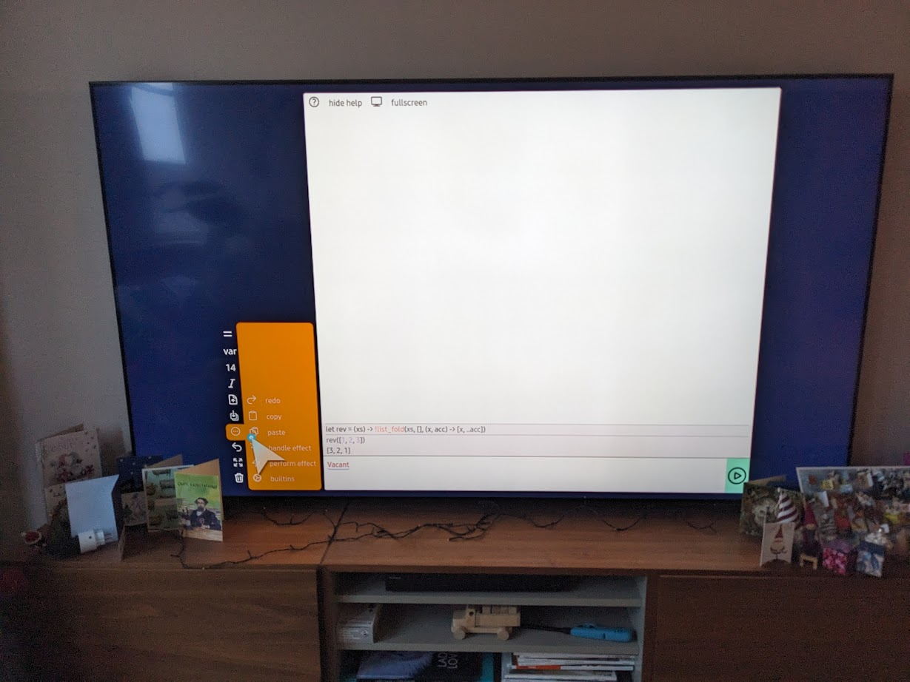

The top image shows the structural editor, and shell, for the [eyg](https://eyg.run) programming language running on a phone.
Later on I'll show it running on a TV.
On both devices the structural editor is a better coding experience than a text editor would be.

This post outlines the evolution of the editor over several years, and highlights the major changes over time along with some design thoughts and implementation notes.
The web editor is built in [Gleam](https://gleam.run/) and [Lustre](https://github.com/lustre-labs/lustre); originally it was [Gleam](https://gleam.run/) and [Svelte](https://svelte.dev/). 
There also exists a terminal based structural [editor built in Go](https://vimeo.com/827006232).

Want to jump in and code with it? The latest version is at [eyg](https://eyg.run).

## Why build a structural editor?

Structural editors, also known as projectional editors, enhance writing, editing and understanding code. Unlike traditional text-based editors, these tools treat code as a structured tree rather than a flat sequence of characters.

*This structured data may be the Abstract Syntax Tree(AST) of the represented program, however it can also be a different structure.
For this post I won't quibble over the differences.*

Some traditional editors have tools that understand the code structure, for example autocomplete.
However in most cases these tools work as suggestions and a traditional text editor will accept any input.

I define a structural editor as one that does not accept invalid or arbitrary input.
Changes to the program always proceed through well known states.

This clarification is important because the editors I talk about here render the program to the user as text, but it's important to note that there is no way to enter arbitrary text. 

The benefits of a structural editor are:

1. **No syntax errors.**
  Zero time is spent on missing quotes, semi-colons or other details. 

2. **Better type information.**
Because the program is always in a valid state the type checker can always run and give meaningful feedback.

3. **No keywords**
Variables can be called `var` and functions called `fn`. Either can also be called 🧪 or `!_//` though maybe they shouldn't be.

4. **Rich visualisations**
A program can be shown as box and wires, or boolean logic operators. On a smaller scale a record of latitude and longitude can be shown on a map.

5. **Reduced complexity**
There is no lexer or parser so issues like [fault tolerant parsing](https://gleam.run/news/fault-tolerant-gleam/) are entirely circumvented.

Several other structed editor projects exist. Jetbrains has [MPS](https://www.jetbrains.com/mps/) which targets creating your own domain specific languges.
[Tylr](https://tylr.fun/) is a beautiful example but currently only good for one line of code at a time.

## An adhoc first attempt

This is my first recording of the structural editor - admire the minimalistic and clean look. 

<div style="padding:62.5% 0 0 0;position:relative;"><iframe src="https://player.vimeo.com/video/664401317?badge=0&amp;autopause=0&amp;player_id=0&amp;app_id=58479" frameborder="0" allow="autoplay; fullscreen; picture-in-picture; clipboard-write" style="position:absolute;top:0;left:0;width:100%;height:100%;" title="Week 1"></iframe></div><script src="https://player.vimeo.com/api/player.js"></script>

The first generation editor worked by directly editing the AST with no effort to hide the details from the user.

Pressing `a` increased the selection by moving the current selection to the parent node, `j/k` moved to the previous/next node and
`i` entered insert mode on the current node. You might see the vim influence of these bindings. 

This first version got a few things right.
The command pallet approach in particular is very nice.
It allows you to put a lot of help with certain actions. 
For example when creating a variable the pallet can show all the variables in scope at that position.

At the outset the AST design was driven by the development of the editor, one single enum represented all the expressions in the program.
This is the complete expression type from that time.
```gleam
pub type Node(m, g) {
  Binary(value: String)
  Tuple(elements: List(Expression(m, g)))
  Record(fields: List(#(String, Expression(m, g))))
  Access(value: Expression(m, g), key: String)
  Tagged(tag: String, value: Expression(m, g))
  Variable(label: String)
  Let(pattern: Pattern, value: Expression(m, g), then: Expression(m, g))
  Function(pattern: Pattern, body: Expression(m, g))
  Call(function: Expression(m, g), with: Expression(m, g))
  Case(
    value: Expression(m, g),
    branches: List(#(String, Pattern, Expression(m, g))),
  )
  Hole
  Provider(config: String, generator: Generator, generated: g)
}
```

The update function, called when you press a key in the editor,
was a huge case statement for each combination of key pressed and current position in the tree.
This approach although simple didn't scale with complexity.
The AST was used by the editor, type checker and code generation so it was not possible to adapt it to the requirements of any particular use case.

In this first version too many concerns were rolled into one project.

*The `Provider` node is my implementation of type providers and not part of this story.
But you can see other videos in my [log](https://petersaxton.uk/log/) about them.*

This first effort eventually ground to a halt under its complexity.

## A simple AST

As a rich AST could not work for all usecases I focused on creating the simplest AST.
Complexity for type checking or editing would move to the appropriate modules.

```gleam
pub type Expression {
  Variable(label: String)
  Lambda(label: String, body: Expression)
  Apply(func: Expression, argument: Expression)
  Let(label: String, definition: Expression, body: Expression)
  Vacant(comment: String)
  Binary(value: BitArray)
  // .. other primitives for integer, string and builtins
  Empty
  Extend(label: String)
  Select(label: String)
  // .. other operators for lists, unions, effects and references
}
```

This AST was the result, it still looks almost [identical today](https://github.com/CrowdHailer/eyg-lang/blob/8a2a5c0a82ea99a321cfe8e7a0f6cbecaac4f97a/eyg/src/eygir/expression.gleam#L22-L61)

By making all features of the language first class, there is a minimal number of compound nodes in the tree. 
Only `Lambda`, `Apply` and `Let` contain child expressions.

To create the record literal `{name: "Eve"}` required the following expression
```gleam
Apply(Apply(Extend(label: "name"), String("Eve")), Empty)
```

This change makes interpretation and type checking much simpler, take my word for it.

It also simplifies several details of the editor for example:
Positions in the tree are denoted by a list of integers where each integer identifies the child node.
This path is followed from the root node until the required point in the tree.

This `step` function implements one step of following that path, it takes an expression and goes to n'th child.
Only the three nodes mentioned have to be taken into account by the `step` function.
It is known that asking for a child of any other kind of node is an error.
This means that variants can be added/removed to the `Expression` type without in any way modifying or moving around the tree.

```gleam
pub fn step(exp, n) {
  case exp, n {
    e.Lambda(param, body), 0 -> Ok(#(body, e.Lambda(param, _)))
    e.Apply(func, arg), 0 -> Ok(#(func, e.Apply(_, arg)))
    e.Apply(func, arg), 1 -> Ok(#(arg, e.Apply(func, _)))
    e.Let(label, value, then), 0 -> Ok(#(value, e.Let(label, _, then)))
    e.Let(label, value, then), 1 -> Ok(#(then, e.Let(label, value, _)))
    _, _ -> Error("invalid path")
  }
}
```

This change didn't effect the external look of the editor but it did substantially clean up the implementation.

## Text editing is ~~intuitive~~ familiar

Moving around the code was tricky in the previous editor. 
This was because the order of nodes in the tree might not match the order they were shown on screen.

For example selecting the field from a record.

```gleam
let x = user.name
```
If `user` is selected, to move to `name` required moving left and another move left would jump back to the `x` of the variable declaration.

This is because the `.` syntax is sugar for calling the select operator on the variable user. 
In all other cases arguments come after the function but, for select, reversing the order it's projected to the user makes more sense.

```gleam
Apply(Select("name"), Variable("user"))
```

Making transformations directly on the AST felt powerful but there were too many occasions where an understanding of the AST was needed to know how to move.

The next version aimed to fix the navigation issue by keeping a cursor centric approach.
This means that one key press of left moves the cursor one position left and a key press of right moves the cursor one position right.

Even with moving back to a text based navigation I wanted a fully structural editor so that the program was always a valid structure. 

Traditional editors have similar behaviour, for example: when typing `(` an automatic `)` is often placed.
In this way you don't go through a state of having unmatched brackets. 
The main difference is in a text editor this bracket matching features are adhoc and many other ways exist to create a syntactically invalid program.


You can see this working here. 
<div style="padding:56.25% 0 0 0;position:relative;"><iframe src="https://player.vimeo.com/video/833330371?h=9aeaa64b46&amp;badge=0&amp;autopause=0&amp;player_id=0&amp;app_id=58479" frameborder="0" allow="autoplay; fullscreen; picture-in-picture; clipboard-write" style="position:absolute;top:0;left:0;width:100%;height:100%;" title="05/06/2023, Features of the structured editor"></iframe></div><script src="https://player.vimeo.com/api/player.js"></script>

This editor was actually quite short lived.
I liked that it showed the type of holes in the program directly in the editor.

However the editor was unintutive in many cases.
Keeping the editor structural but pretending it wasn't led to too many inconsistencies.
There were places that typing certain characters would do nothing because the character was invalid.

Implementing this editor got complicated quickly.
Intercepting all keyboard events meant dropping out of Gleam and understanding the [range and selection](https://javascript.info/selection-range) API's in the browser. This resulted in a lot of [foreign function interface code](https://github.com/CrowdHailer/eyg-lang/blob/40d1606d50292724970d79a6b1f61926294bc10f/eyg/src/easel_ffi.js)

A positive aside of this effort to go text based meant I wanted better Gleam bindings to the browser API's and that need kicked off building [plinth](https://github.com/crowdhailer/plinth) a library to do just that.

## Adding sugar and projections

The two previous editors were at opposing ends of a spectrum.
For the first, movement was entirely based on the layout of the AST.
For the second, movement was entirely based on the layout of the text.

I wrote approximately 10k "lines" of EYG code, including a JSON parser and type checker, using the simple AST editor.
Transforming the AST felt very powerful when it worked. However, where the visuals did not match the AST representation navigation was unintuitive.
I eventually mastered it but it was clearly a blocker for anyone else picking up the editor.

This generation of the editor tries to find a middle ground one the spectrum from text to AST.
Navigation is always by whole AST nodes. In addition directions are always consistent with how the program is laid out on screen.

This was achieved by creating a representation of the program specifically for manipulation in the editor. There is:

1. [`Editable`](https://github.com/CrowdHailer/eyg-lang/blob/441e5686c6721373d6b66636c4f1ce73301d60d7/eyg/src/morph/editable.gleam#L11-L30) a type which deals with larger code units than the basic AST
2. [`Projection`](https://github.com/CrowdHailer/eyg-lang/blob/441e5686c6721373d6b66636c4f1ce73301d60d7/eyg/src/morph/projection.gleam#L234-L299) a zipper into the `Editable` type that makes navigation and transforms more efficient.
3. [`Frame`](https://github.com/CrowdHailer/eyg-lang/blob/441e5686c6721373d6b66636c4f1ce73301d60d7/eyg/src/morph/lustre/frame.gleam#L9-L17) an intermediate representation for rendering expressions that track if they are single or multiple lines.

The basic AST is still used by the interpreter and type checker so the complexity of presenting code to the user is only in the modules which deal with showing code to a user.

<div style="padding:56.25% 0 0 0;position:relative;"><iframe src="https://player.vimeo.com/video/984437518?badge=0&amp;autopause=0&amp;player_id=0&amp;app_id=58479" frameborder="0" allow="autoplay; fullscreen; picture-in-picture; clipboard-write" style="position:absolute;top:0;left:0;width:100%;height:100%;" title="7/15/2024, Structured editor in a code notebook."></iframe></div><script src="https://player.vimeo.com/api/player.js"></script>

## Using the mouse

Working with a keyboard is efficient, but only if you know the key bindings to each action you need.
Which key to press to get a desired action is not discoverable from looking at the UI element.
After all the UI for keyboard actions is just a cursor somewhere in the page.

A user is required to consult a cheatsheet of keyboard actions and learn some before ever getting started.
This friction makes getting started very challenging.

Devices without keyboards have to show virtual keyboards to use keyboard shortcuts.
If the actions are being presented on screen they might as well be shown as something more relevant than the letter code corresponding to the short cut.

This latest iteration adds a menu and icon based UI for each transformation that is possible on the AST.
A question mark button at the top toggles showing text descriptions of each action but at the cost of less screen to work with.
The UI works with keyboard, mouse, touch or TV remote.



It also works great with a keyboard and if you forget the key, seemlessly switch to the visual.

Implementing the visual UI was simple with Lustre and the state and event approach it has.
Lustre is an implementation of the Elm architecture.

The state of the program works by [switching on key press events](https://github.com/CrowdHailer/eyg-lang/blob/441e5686c6721373d6b66636c4f1ce73301d60d7/website/src/website/components/snippet.gleam#L302-L352).

```gleam
pub fn update(state, message) {
  let Snippet(status: status, ..,) = state
  case message, status {
    UserPressedCommandKey(key), Editing(Command(_)) -> {
      let state = Snippet(..state, using_mouse: False)
      case key {
        "ArrowRight" -> move_right(state)
        "ArrowLeft" -> move_left(state)
        "ArrowUp" -> move_up(state)
        "ArrowDown" -> move_down(state)
        " " -> search_vacant(state)
        // Needed for my examples while Gleam doesn't have file embedding
        "Q" -> copy_escaped(state)
        "w" -> call_with(state)
        "E" -> assign_above(state)
        "e" -> assign_to(state)
        "r" -> insert_record(state)
        "t" -> insert_tag(state)
        "y" -> copy(state)
        "Y" -> paste(state)
        // "u" ->
        "i" -> insert_mode(state)
        "o" -> overwrite_record(state)
        "p" -> insert_perform(state)
        "a" -> increase(state)
        "s" -> insert_string(state)
        "d" | "Delete" -> delete(state)
        "f" -> insert_function(state)
        "g" -> select_field(state)
        "h" -> insert_handle(state)
        "j" -> insert_builtin(state)
        "k" -> toggle_open(state)
        "l" -> insert_list(state)
        "#" -> insert_reference(state)
        "z" -> undo(state)
        "Z" -> redo(state)
        // "x" ->
        "c" -> call_function(state)
        "v" -> insert_variable(state)
        "b" -> insert_binary(state)
        "n" -> insert_integer(state)
        "m" -> insert_case(state)
        "M" -> insert_open_case(state)
        "," -> extend_before(state)
        "EXTEND AFTER" -> extend_after(state)
        "." -> spread_list(state)
        "TOGGLE SPREAD" -> toggle_spread(state)
        "TOGGLE OTHERWISE" -> toggle_otherwise(state)

        "?" -> #(state, ToggleHelp)
        "Enter" -> execute(state)
        _ -> show_error(state, NoKeyBinding(key))
      }
    }
  }
}
```

The UI buttons make use of the same events and update logic.
Each button in the visual UI consists of;

- the icon to show (I use the heroicon library and the outline style)
- a text description of the action (which is shown when "show help" is on)
- the keypress event to dispatch.


```gleam
fn cmd(x) {
  ShellMessage(snippet.UserPressedCommandKey(x))
}

fn item_before() {
  #(outline.arrow_turn_left_down(), "item before", cmd(","))
}

fn item_after() {
  #(outline.arrow_turn_right_down(), "item after", cmd("EXTEND AFTER"))
}

fn undo() {
  #(outline.arrow_uturn_left(), "undo", cmd("z"))
}

fn redo() {
  #(outline.arrow_uturn_right(), "redo", cmd("Z"))
}
```

*There are more actions than available keys so the `EXTEND AFTER` string value can be dispatched by clicking the correct button, but not by any keyboard binding.*

Here is the final result, as of today. 

<div style="padding:56.25% 0 0 0;position:relative;"><iframe src="https://player.vimeo.com/video/1043702197?badge=0&amp;autopause=0&amp;player_id=0&amp;app_id=58479" frameborder="0" allow="autoplay; fullscreen; picture-in-picture; clipboard-write" style="position:absolute;top:0;left:0;width:100%;height:100%;" title="1/3/2025, Fibonacci sequence in visual editor"></iframe></div><script src="https://player.vimeo.com/api/player.js"></script>

## What's next

There will be more iterations of the editor but this one is interesting.
I want to see what other people make of the structured editor experience.
You can [try it out now](https://eyg.run/) and if you have any opinions please get in touch. *[Bluesky](https://bsky.app/profile/crowdhailer.bsky.social) the best right now*.

The EYG language is still developing. References to external packages and better error messages based on effects will be coming soon.
To keep up with that progress join the newsletter.
