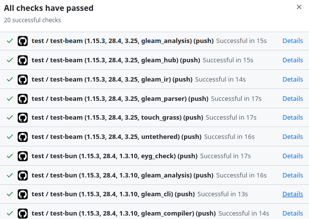

I'm a fan of a Gleam monorepo to break a project into separate packages.
Separate packages are required if you want to target multiple runtimes,
such as JavaScript for a client app and erlang for a robust backend service.

There is no need to stop at just a frontend/backend split.
[EYG](https://github.com/CrowdHailer/eyg-lang) is a statically typed functional scripting language that I have been writing with the goal of being a better bash.
I want users to be able to pick and choose parts of the tooling so it is decomposed into over a dozen packages.
Some packages run on the BEAM, some compile to JavaScript, and some work on both runtimes.

The rest of this post is a hopefully concise summary of my CI setup.

## Repo structure

I am using GitHub Actions for CI.
All the CI configuration lives in `.github/workflows/test.yml`

Each Gleam package sits in `packages/<name>` and has its own `gleam.toml`.

```
packages/
  gleam_analysis/
  gleam_compiler/
  gleam_hub/
  gleam_interpreter/
  gleam_parser/
  morph/
  website/
  ...
```

## Job structure

The greatest difference between test runs is the runtime they're based on.
The workflow has a job for each runtime, `test-beam` and `test-bun`.

*A third `test-db` job exists, I'm not going to dive into it here as it also runs on the BEAM.*

### Runtime setup

Each job specifies a matrix of values.
These values include the version of the runtime and all the packages that should be tested.

I use the matrix of `gleam` versions to quickly test release candidates.
We are currently in the release candidate cycle for `1.16.0` adding one field here gives me a heads up of any issues that might effect any of the packages.

```yaml
test-beam:
  runs-on: ubuntu-latest
  strategy:
    fail-fast: false
    matrix:
      gleam: ["1.15.4", "v1.16.0-rc3"]
      otp: ["28.4"]
      rebar3: ["3.25"]
      package: ["gleam_analysis", "gleam_hub", "gleam_ir", "gleam_parser", "touch_grass", "untethered"]
```

`fail-fast: false` is important here.
Without it, one failing package would cancel all the others and you'd lose visibility into what else is broken.

There is a similar list of packages for `test-bun` I try to run as many packages as possible on both targets.
The "sans-io" pattern is working well for me as an approach to make packages runtime agnostic.
Hopefully I'll write a post about that soon.

Not every package appears in both matrices.
For example, `gleam_cli` is very closely tied to [bun](https://bun.com/) as I use it for building single file executables as a way to distribute the cli.

### Tests and other checks

The actual testing is defined in the actions steps.

```yaml
steps:
  - uses: actions/checkout@v4
  - uses: erlef/setup-beam@v1
    with:
      otp-version: ${{matrix.otp}}
      gleam-version: ${{matrix.gleam}}
      rebar3-version: ${{matrix.rebar3}}
  - run: gleam deps download
    shell: bash
    working-directory: packages/${{matrix.package}}
  - run: gleam build --warnings-as-errors
    working-directory: packages/${{matrix.package}}
  - run: gleam test
    working-directory: packages/${{matrix.package}}
  - run: gleam format --check src test
    working-directory: packages/${{matrix.package}}
```

I am as strict as possible in my checks.
Running `gleam build --warnings-as-errors` ensures CI fails for any compiler warnings.
It's useful to be able to develop locally with warnings occurring but by the time I push I don't want any of them.
Running `gleam format --check src test` fails CI if any files are not formatted correctly.
I've extended the check to cover test files as well.

## Output in GitHub

With this approach each combination of package and runtime gets its own line in the CI report.
This is really helpful to see if a failing test is due to a dependency also having an error
or for checking that a bug only affects a specific Gleam version.




And that's it really.