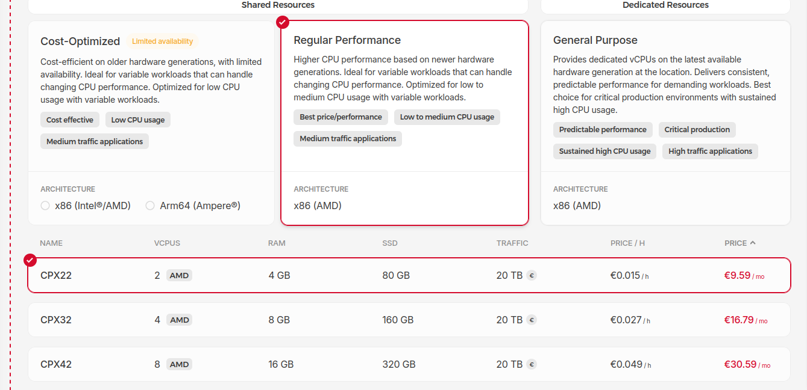

I've been experimenting with coding harnesses (Claude Code, Codex, [Overlay](https://github.com/CrowdHailer/overlay) etc) recently.
My goal is to run them totally async to see how much work they could complete independently.

Running the harness fully async means permitting them to proceed without asking me for confirmation.
This level of autonomy requires using flags like `--dangerously-skip-permissions`.

For my peace of mind this means running them totally isolated from my computer.

### further goals

In addition to the main isolation goal the setup should also:

- **Run asynchronously**, work should continue without my input or my computer being on.
- **Full access to the computer**, what can be achieved if really leaning into these tools.
- **Run multiple tools**, this is a new design space and running multiple tools allows me to see what is common and what is novel with each tool.

My approach is to install the agents on a dedicated VPS and to collaborate via a Git workflow.
This is my setup.

## Setup a VPS.

I buy my VPSs from [Hetzner](https://www.hetzner.com/).
Their dashboard is intuitive, my ssh keys are installed on each new box and the pricing is agreeable.



A small machine is plenty because the LLMs will be running elsewhere.
This box will only be making API calls and pushing files around locally.

*To be totally fair it will also compile code and run tests.*
*However the [Gleam](https://gleam.run/) and [EYG](https://github.com/CrowdHailer/eyg-lang) tooling is fast and my workflow is async so making compilation faster changes my overall progress very little.*

On the VPS I set up a user for each agent, install a few dependencies and configure Git.

### Install core dependencies

First install `git`, `tmux` and `curl`.
These dependencies all make working with this setup easier.
The individual coding harnesses I install manually.
I want to see how each harness is managing their install process.
Also installing on a clean Ubuntu box should never be a difficult process.

All further language tooling I expect the harness to install itself as necessary.

### Create agent users

Each agent gets its own user.
For each user, a script will copy across the set of allowed ssh keys from the root user.
This means I can ssh to any of the users directly.

My workflow is to ssh to an individual user and get straight to work with its harness.

### Grant sudo access

Each user has sudo permissions so it can install what's needed.

I want to see what they can achieve with full access to a computer.
Giving them full access and seeing how often they mess up is part of the experiment.

This setup does make it possible for one agent to affect another but that was always possible once they were on the same machine.
My recovery process for any misbehaviour from my agents is the same, get a fresh VPS.

### Configure git

After carefully isolating my agents from my workflow I can't undo that work by allowing them to act as me on GitHub.
Instead I have a [bot account](https://github.com/crowdhailer-bot/)
*GitHub allows accounts for bots but doesn't allow bots to create accounts.*

I trust all the agents equally little so they all get access to the same bot account.
Before running the setup script I copy across a shared private key that has ssh access to the bot account on GitHub.

I keep this key in my password manager and copying a single key to the VPS is quicker than creating keys per user and adding them to GitHub.

### All in on script

This VPS is intended to be disposable.
For me to throw it away quickly setup needs to be trivial and reproducible.
The script does all the above

```bash
#!/usr/bin/env bash
set -euo pipefail

AGENTS=("vikki" "clara" "corin" "gerry")
apt-get update -q
apt-get install -y -q git tmux curl

key_source="/tmp/ed25519"

shared_key=$(cat "$key_source")
[[ -z "$shared_key" ]] && { 
  echo "Error: no private key provided in /tmp/ed25519";
  exit 1; 
}

for name in "${AGENTS[@]}"; do
  echo "--- Setting up agent: $name ---"

  # Create user if doesn't exist
  if ! id "$name" &>/dev/null; then
    useradd -m -s /bin/bash "$name"
    # Grant sudo for "Yolo mode" software installation
    echo "$name ALL=(ALL) NOPASSWD:ALL" > "/etc/sudoers.d/$name"
    chmod 440 "/etc/sudoers.d/$name"
  fi

  home_dir="/home/$name"
  ssh_dir="$home_dir/.ssh"
  key_path="$ssh_dir/id_ed25519"

  mkdir -p "$ssh_dir"

  # Copy authorized keys to each user
  cp /root/.ssh/authorized_keys "$ssh_dir/authorized_keys"
  
  echo "$shared_key" > "$key_path"

  # FIX: Set restrictive permissions BEFORE calling ssh-keygen
  chmod 600 "$key_path"

  # Generate the public key from the private
  ssh-keygen -y -f "$key_path" > "${key_path}.pub"

  # Add github.com to known_hosts to prevent interactive prompts
  ssh-keyscan -t ed25519 github.com >> "$ssh_dir/known_hosts" 2>/dev/null

  # --- Grouped Permission Updates ---
  # This ensures the user owns the directory and has the right bits to 
  # swap out known_hosts files.
  chown -R "$name:$name" "$home_dir"
  chmod 700 "$ssh_dir"
  chmod 600 "$ssh_dir/authorized_keys"
  chmod 644 "${key_path}.pub"
  chmod 644 "$ssh_dir/known_hosts"

  # git commands need to be run as the correct user so that the config ends up in the users gitconfig file.
  sudo -u "$name" git config --global user.name  "$name"
  sudo -u "$name" git config --global user.email "${name}@example.com"
done

rm -f "$key_source"
```

## Shared context

All guidance on how I like to work is kept in a private repo.
Each bot user clones that to their home directory.

This contains instructions in `CLAUDE.md` and `AGENTS.md` for how I like to work.
For example all project repos are cloned to the `~/home/assistance/Projects` directory.
Work should be committed and pushed frequently.

## Git workflow

Now, the agents are working on their own machine and pushing to their own GitHub account.
Giving them a GitHub account means I can use forks and branches for collaboration.

For helping me with [EYG](https://github.com/CrowdHailer/eyg-lang) the flow is as follows.

1. Fork the repo to the bot account
2. The agents clone the fork, work locally and push.
3. I add the fork as a remote `git remote add bot ...`

## local ssh config

To kick off a task I ssh to the correct user and use the terminal tool there.
I use tmux to make sure the session keeps running when my connection drops.
tmux also allows me to resume a session trivially.

I have the following ssh config to make connection easy.

```sh
# Common settings for all agents on this VPS
Host vikki clara corin gerry
  HostName <vps-ip>
  RequestTTY yes
  # -A attaches to an existing session, if no session it creates one
  # -s specifies the session name 'work'
  RemoteCommand tmux new-session -A -s work

# Specific User Definitions
Host vikki
  User vikki

Host clara
  User clara

Host corin
  User corin

Host gerry
  User gerry
```

## lessons

I think [the five levels](https://www.danshapiro.com/blog/2026/01/the-five-levels-from-spicy-autocomplete-to-the-software-factory/)
is a good framework to map out my progress.
This setup has allowed me to move beyond the spicy autocomplete stage and boilerplate writing stage.

I haven't yet merged a code suggestion unmodified from the AI.
What I have got is insights that have unblocked me quicker than digging through code myself.

The following lessons work well for me with mid 2026 models.

- Throw away the machine frequently. If the agent makes a mess don't understand why just move on.
- Create small artifacts and tell the agent to push them.
  My favourite prompt is try and implement a feature, write tests, then **write a tutorial** for how to implement the feature.
  Often I never look at the agents code but working through its tutorial gets me where I need in addition to having seen all the committed code.
- I don't need to watch progress. 
  There is a VSCode plugin that allows you to open projects on a remote machine.
  I used this heavily for the first week and haven't touched it since.
- Trust is really important.
  I'd like to have this ability to ask questions of codebase on my machine but I do not trust arbitrary bash execution.
  Maybe once [Overlay](https://github.com/CrowdHailer/overlay) with [EYG](https://github.com/CrowdHailer/eyg-lang) as its scripting language develops, I'll have something I can run locally.
