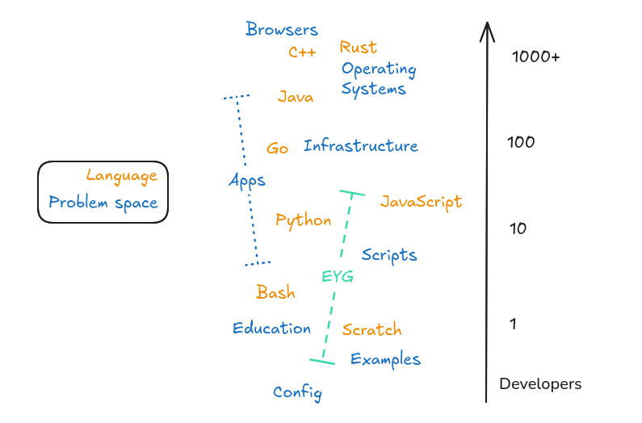
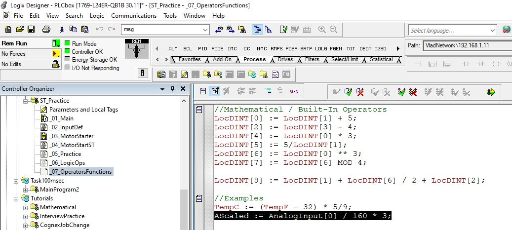

[Eat Your Greens (EYG)](https://github.com/crowdhailer/eyg-lang) is a statically typed functional programming language.
It is a better programming language, for some measure of better.
This post explains what I consider to be better and which features that requires adding or removing from the language.

## End user ~~programming~~ disappointment

I started building a language during a 10 week wait for my visa to start a new job in Sweden.
I built EYG specifically after noticing a recurring pattern amongst technically minded, but not professional, developers.

The pattern was a cycle like the one below.

1. A technically minded person identifies a problem they feel they should be able to automate.
2. They choose a nocode or locode tool and get it working.
3. Quickly they get frustrated as growing complexity isn't handled well by the tool.

At this point there are two choices:

- Ask a developer for help, they immediately throw out the first solution saying it needs rewriting in a "real" language.
- The original maker starts learning the "real" programming language themselves and progress slows while they do.

These tools and problems fall in the broad category of end user programming.
Some people prefer citizen developer because it captures the usecase of non professionals making useful contributions at work.
My favourite way to describe software not for mass consumption is [home cooked](https://www.robinsloan.com/notes/home-cooked-app/).

Essentially creating software to solve a problem should be available to people who don't make it their full time identity to be a developer.

## Humans vs Developers

This section was nearly the title of this post.

Full time developers can spend more time keeping up with changing technology than others.
If only 10% of your job is writing software then reading about writing software isn't happening.

Sympathy for the machine only exists in developers. They will happily explain why integer overflows need to happen.
The average human response to integer overflows is "WTF, that's not how numbers work".
We have `BigInt` and 99% of the time the WTF response is the correct one.

On average, developers are working on larger problems. This makes sense - some developers are working on software projects with hundreds of others, whereas end user software is probably less than one human's fulltime attention.
This means developer tools underserve the smaller problems.

## My hypothesis

Developers deal with two broad categories of work.

1. Describing the logic of the problem they are solving using language constructs like `if`, `loop`, `var` etc.
2. Working with computers to run those problems using constucts like `$PATH`, `/var/tmp` and AWS.

There are a lot of humans who can do the first work fine but don't have the time to master the second category.
I call these humans "makers".

Therefore any end user programming tool that tries to make programming easier, say by creating a visual language, is solving the wrong problem.

Excel is the darling of any end user programming conversation. "It's actually the most popular programming language, don't you know".
An Excel macro remains textual programming, but removes all issues around deploying and running the macro.
Excel completely solves category 2.

EYG exists to remove category 2 problems (they are handled automatically by platforms or runtimes) and let makers focus on describing their problem.
It focuses on the home cooked end of the software spectrum.
EYG is a good choice for:

- Glue Problems: "I need this spreadsheet to talk to this Discord bot."
- A Personal Dashboard: "I want to see my solar panel output and my calendar in one place on an old iPad."
- An Automation: "If my doorbell rings and I'm on a Zoom call, flash my desk lamp."

## Further evidence from Gleam

While in Sweden I worked with automation engineers.
They are technically literate people but they spend as much time thinking about electrical, mechanical and safety issues than they do about the software.

This is the software environment they work in.

Clearly they are real programmers.
Yet I watched several of them go through the same cycle as above when trying to build software in other domains, such as a website.

What has this got to do with Gleam?

Well I managed to convince a few of them to do the [Gleam tour](https://tour.gleam.run/).
A statically typed functional language was a new paradigm for them and yet these engineers had no trouble learning Gleam.
In fact they mostly finished the tour and asked "now what".
They were happy with the constructs of the language but didn't know where to apply it and how to deploy it.

Gleam is a wonderful language that really neatly allows you to express your solution to domain problems (category 1).
But there are still pains around releases and deployment.
It's clearly not at Excels level of convenience in smoothing out category 2 problems.

### Why not work on Gleam

For a while my language was experiments that I hoped might make it back to Gleam.
However there are a few irredeemable differences due to different priorities.

Gleam is nominally typed and EYG is structurally typed.
Nominal typing is the best way for a professional to rigorously describe a domain.
Structural typing is the best way for a computer to help a user without them requiring to think about the types ahead of time.

Gleam is for developers building applications.
EYG is for makers building features.

## EYG features

There are many choices EYG makes to work well for the makers it wants to support.
Below are the main areas where it differs from other languages.

### Sound type inference

At this point I think types are a good choice for everyone.
The trend is from JavaScript to TypeScript (and on to Gleam).
For EYG I chose a type system that never forces a user to define a type ahead of time and it is optional to run it.
It focuses on making the type system a best in class helper rather more ceremony in the process of writing software.

### Hashed dependency

After convincing those automation engineers to try Gleam the thing that caused the most issues was understanding dependency hell when updating.
Gleam was still pre 1.0 so they happened more often than it does now.
EYG steps around the dependency issue by defining dependencies inline where they are identified by the hash of the module's contents.

### Effect typing

Capturing side effects in the type system enables a runtime to provide more help to the maker.
When writing a script for a webpage any dependency that calls the file system will show up as a helpful type error.
I have plans to take this further; for example a platform might be able to provision a key value store only if your lambda function uses the key value effects.

## Other measures of better

My measure of better is how well the language enables makers to build reliable, sharable programs.
This extends to configuration, scripts, automations, widgets etc.  

This is my measure of better and of course there are others.
If you are looking for the best language for a large team to build a new browser may I suggest Rust.
